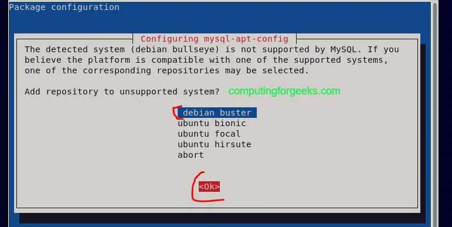
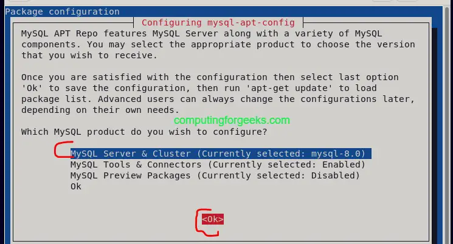
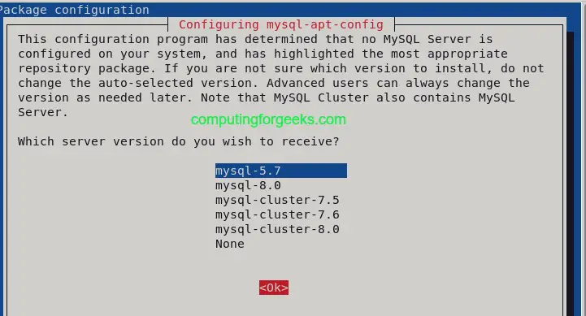
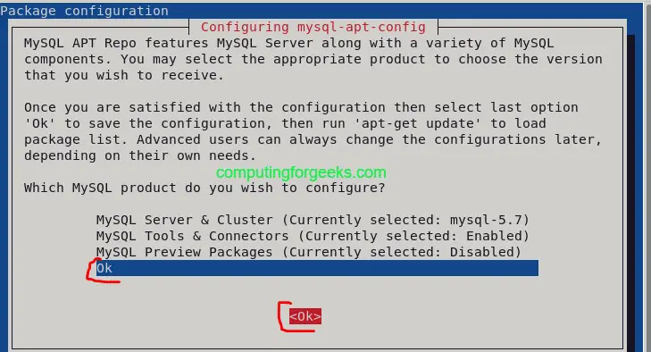

# Instalar DCM4CHEE 2.18.3 en Debian 12.

**Empezamos con actualizar el sistema.**

1- apt update && apt upgrade -y  
2- Descargar estos fiheros: 

DCM4CHEE-2.18.3  
https://sourceforge.net/projects/dcm4che/files/dcm4chee/2.18.3/dcm4chee-2.18.3-mysql.zip/download 

JBOS-4.2.3 
https://sourceforge.net/projects/jboss/files/JBoss/JBoss-4.2.3.GA/jboss-4.2.3.GA-jdk6.zip/download 

De aqui descargar jdk-7u80-linux-x64.tar.gz 
https://www.oracle.com/java/technologies/javase/javase7-archive-downloads.html 

3- mkdir -p /usr/local/java 
4- cp -r jdk-7u80-linux-x64.tar.gz /usr/local/java/ 
5- cd /usr/local/java 
6- tar xvzf jdk-7u80-linux-x64.tar.gz 
7- nano /etc/profile vas hasta el final del archivo /etc/profile y agregas las siguientes lineas: 
JAVA_HOME=/usr/local/java/jdk1.7.0_80 
JRE_HOME=/usr/local/java/jdk1.7.0_80  
PATH=$PATH:$JRE_HOME/bin:$JAVA_HOME/bin 
export JAVA_HOME 
export JRE_HOME 
export PATH 
8-Actualizas las alternativas: 
update-alternatives --install "/usr/bin/java" "java" "/usr/local/java/jdk1.7.0_80/bin/java" 1 
update-alternatives --install "/usr/bin/javac" "javac" "/usr/local/java/jdk1.7.0_80/bin/javac" 1 
update-alternatives --install "/usr/bin/javaws" "javaws" "/usr/local/java/jdk1.7.0_80/bin/javaws" 1 
update-alternatives --set java /usr/local/java/jdk1.7.0_80/bin/java 
update-alternatives --set javac /usr/local/java/jdk1.7.0_80/bin/javac 
update-alternatives --set javaws /usr/local/java/jdk1.7.0_80/bin/javaws 
9-Recargas el profile: 
source /etc/profile 
10-Verificas la instalacion del java con el comando: 
java -version 
Te debe devolver esto: 
java version "1.7.0_80" 
Java(TM) SE Runtime Environment (build 1.7.0_80-b15) 
Java HotSpot(TM) 64-Bit Server VM (build 24.80-b11, mixed mode) 
11-Instalamos Mysql Server pero aca necesitamos una version antigua por que las actuales dan error con los indices al importar las bd. 
wget https://dev.mysql.com/get/mysql-apt-config_0.8.18-1_all.deb 
dpkg -i mysql-apt-config_0.8.18-1_all.deb 
Tambien pueden agregar manual en /etc/apt/sources.list 
deb http://repo.mysql.com/apt/debian/ buster mysql-apt-config 
deb http://repo.mysql.com/apt/debian/ buster mysql-5.7 
deb http://repo.mysql.com/apt/debian/ buster mysql-tools 
deb-src http://repo.mysql.com/apt/debian/ buster mysql-5.7 
apt update 
Les dara este error no se asusten 
The following signatures couldn't be verified because the public key is not available: NO_PUBKEY 467B942D3A79BD29 
apt-key adv --keyserver keyserver.ubuntu.com --recv-keys 467B942D3A79BD29 
apt update 
apt install -y mysql-community-server 
 
 
 
 
sudo systemctl restart mysql 
sudo systemctl enable mysql 
escribimos  
mysql_secure_installation 
y van respondiendo las preguntas segun le interese por mi parte lo deje todo por defecto. 
12- Escribimos mysql -u root -p 
Creas la siguiente estructura: 
mysql> create schema pacsdb;   
mysql> grant all on pacsdb.* to pacs@localhost identified by 'pacs';   
mysql> flush privileges;   
mysql> \q 
12-Extraes dcm4chee-2.18.3-mysql.zip y jboss-4.2.3.GA-jdk6.zip en mi caso lo hice en /opt/ 
13-Como usamos un sistema de 64 bits, y la estructura del dcm4chee es de 32 bits tenemos que parcharlo: 
wget http://download.java.net/media/jai-imageio/builds/release/1.1/jai_imageio-1_1-lib-linux-amd64.tar.gz 
tar xzvf jai_imageio-1_1-lib-linux-amd64.tar.gz 
cp jai_imageio-1_1/lib/libclib_jiio.so /opt/dcm4chee-2.18.3-mysql/bin/native/libclib_jiio.so 
14-Ahora instalamos jboss: 
cd /opt/dcm4chee-2.18.3-mysql/bin/   
./install_jboss.sh /opt/jboss-4.2.3.GA 
15-Importamos los indices: 
cd /opt/dcm4chee-2.18.3-mysql/sql/  
mysql -upacs -p pacsdb < create.mysql 
Les pidira la clave del usuario pacs que es la misma en la contraseña "pacs", esperen que importe. 
16-Para instalar oviyam2 y el ioviyam2 
copiamos el oviyam2.war y ioviyam2.war dentro de la carpeta /opt/dcm4chee/server/default/deploy 
copiamos la configuracion "iOviyam.properties" /opt/dcm4chee-2.18.3-mysql/server/default 
copiamos la configuracion "oviyam2-7-config.xml" /opt/dcm4chee-2.18.3-mysql/server/default/work/jboss.web/localhost 
y ejecutamos 
/opt/dcm4chee/bin/run.sh & 
17-Para entrar al dcm4chee seria http://ip:8080/dcm4chee-web3/ , para configurar el jbos http://ip:8080/jmx-console/, para consultar el oviyam version escritorio  http://ip:8080/oviyam2, para consultar ioviyan version movil http://ip:8080/ioviyam2. 
18-Tambien le agregue nginx con ssl para darle seguridad al login quedaria de esta forma la configuracion: 
upstream dcm4chee {
   server 127.0.0.1:8080;
}
server {
 listen 80;
 charset UTF-8;
 server_name dcm4hlucia.hlg.sld.cu;
 rewrite ^ https://$server_name$request_uri? permanent;      
}
server {
   listen 443;
   server_name dcm4hlucia.hlg.sld.cu;
   charset utf-8;
    ssl on;
   ssl_certificate /etc/apache2/ssl/fullchain.pem;
   ssl_certificate_key /etc/apache2/ssl/privkey.pem;
    ssl_session_timeout  5m;
    ssl_protocols  TLSv1 TLSv1.1 TLSv1.2;
   ssl_ciphers         HIGH:!aNULL:!MD5;
   ssl_prefer_server_ciphers   on;
   location / {
       return 301 /dcm4chee-web3;
   }
   location /wado {
       proxy_buffering off;
       proxy_pass  http://dcm4chee/wado;
       proxy_set_header Host $host;
   }
   location /dcm4chee-web3 {
       proxy_buffering off;
       proxy_redirect off;
       proxy_pass  http://dcm4chee/dcm4chee-web3;
       proxy_set_header Host $host;
   }    
}
